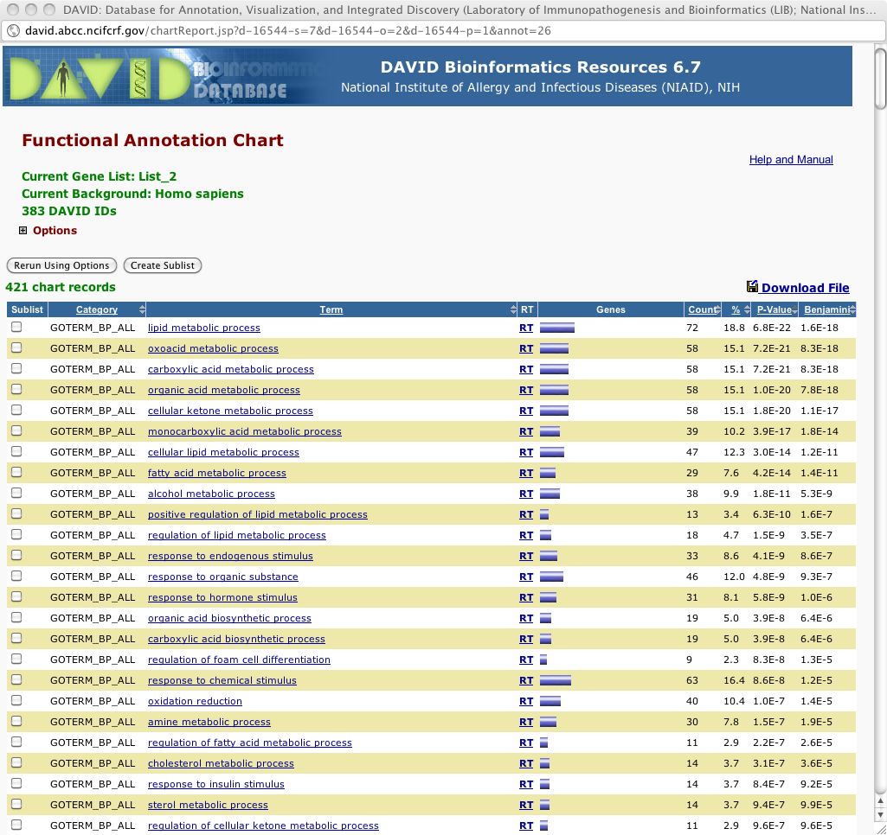
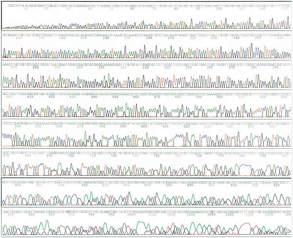

# 「遺伝子発現DB・解析ツールの紹介」　担当：仲里 猛留
<h3 id="content_1_0"><a id="ce386daf" href="http://MotDB.DBCLS.jp/?AJACS34%2Fthecla#ce386daf" title="ce386daf">_</a> はじめに  </h3>

<h3 id="content_1_1"><a id="q72af457" href="http://MotDB.DBCLS.jp/?AJACS34%2Fthecla#q72af457" title="q72af457">_</a> 今回のメニュー  </h3>

<ul class="list1" style="padding-left:16px;margin-left:16px"><li><a href="#ce386daf"> はじめに </a>
<ul class="list2" style="padding-left:16px;margin-left:16px"><li><a href="#q72af457"> 今回のメニュー </a></li></ul></li>
<li><a href="#a8d15bfd"> 1つの遺伝子での遺伝子発現 </a></li>
<li><a href="#h73a6e1c"> BioGPS ヒト、マウス、ラットのさまざまな組織や細胞(株)における遺伝子発現プロファイルのデータベース </a>
<ul class="list2" style="padding-left:16px;margin-left:16px"><li><a href="#xf3c88f3"> 【実習1】BioGPSを使ってある遺伝子の発現プロファイルを調べる </a></li></ul></li>
<li><a href="#rb2d5f2d"> RefEx? 遺伝子発現データのリファレンスデータセット </a>
<ul class="list2" style="padding-left:16px;margin-left:16px"><li><a href="#re78f43f"> 【実習2】RefEx を使っていくつかの遺伝子の発現プロファイルを調べる </a>
<ul class="list3" style="padding-left:16px;margin-left:16px"><li><a href="#uae68b8a"> ある臓器で発現の高いものを調べる </a></li></ul></li></ul></li>
<li><a href="#k4faf531"> 全遺伝子を対象にした（=オミックス）遺伝子発現・その1：マイクロアレイ </a></li>
<li><a href="#gff484c3"> NCBI Gene Expression Omnibus (GEO) </a>
<ul class="list3" style="padding-left:32px;margin-left:32px"><li><a href="#pc9d26c7"> 【実習3-1】GEOを使って、自分の興味のある遺伝子の（ある実験条件下における）発現状況を調べる </a></li>
<li><a href="#b946a2fd"> 【実習3-2】データセットブラウザ(Dataset browser)を利用して、GEOに登録されているマイクロアレイデータを解析する </a></li></ul>
<ul class="list2" style="padding-left:16px;margin-left:16px"><li><a href="#f05c375a"> 【実習4】GEO2Rを利用して、GEOに登録されているマイクロアレイデータを解析する </a></li></ul></li>
<li><a href="#ddf84780"> 遺伝子発現バンク(GEO)目次：http://lifesciencedb.jp/geo/ </a></li>
<li><a href="#a753c041"> [参考] ArrayExpress</a></li>
<li><a href="#c7d295ac"> DAVID: The Database for Annotation, Visualization and Integrated Discovery </a>
<ul class="list3" style="padding-left:32px;margin-left:32px"><li><a href="#v61084ff"> 【実習5】DAVIDを用いて、発現データの結果を生物学的に解釈する </a></li></ul></li>
<li><a href="#d92d75b7"> 全遺伝子を対象にした（=オミックス）遺伝子発現・その2：次世代シーケンサ (NGS) </a></li>
<li><a href="#x0c4b5f7"> 次世代シーケンサ（とそのデータ）基礎知識 </a>
<ul class="list2" style="padding-left:16px;margin-left:16px"><li><a href="#u53454b9"> 何が新型／次世代なのか? </a></li>
<li><a href="#j6cd4673"> SRAとは </a>
<ul class="list3" style="padding-left:16px;margin-left:16px"><li><a href="#sf7df990"> [参考] NCBI SRAやめます事件(11/2/16 現地時間) </a></li></ul></li>
<li><a href="#ge26a128"> 【実習6】DRASearchを使ってみる（ http://trace.ddbj.nig.ac.jp/DRASearch/ ） </a></li>
<li><a href="#ua06a95a"> 統計情報から検索する (SRAs： http://sra.dbcls.jp/ ) </a></li>
<li><a href="#k43437ef"> 文献から検索する </a></li>
<li><a href="#neab7413"> 疾患から検索する </a></li>
<li><a href="#oeb6c9d7"> SRAへのNGSデータの登録 </a></li>
<li><a href="#qcf8b24a"> 解析その1（Whole Genome, Transcriptomics） </a>
<ul class="list3" style="padding-left:16px;margin-left:16px"><li><a href="#c744f850"> DDBJ Read Annotation Pipelineの使い方 </a></li></ul></li>
<li><a href="#ic675a3a"> 解析その2（Metagenomics）：MiGAP の使い方 </a></li></ul></li></ul>

<h3 id="content_1_2"><a id="a8d15bfd" href="http://MotDB.DBCLS.jp/?AJACS34%2Fthecla#a8d15bfd" title="a8d15bfd">_</a> 1つの遺伝子での遺伝子発現  </h3>

<h3 id="content_1_3"><a id="h73a6e1c" href="http://MotDB.DBCLS.jp/?AJACS34%2Fthecla#h73a6e1c" title="h73a6e1c">_</a> <a href="http://biogps.org/" rel="nofollow">BioGPS</a> ヒト、マウス、ラットのさまざまな組織や細胞(株)における遺伝子発現プロファイルのデータベース  </h3>
<ul class="list1" style="padding-left:16px;margin-left:16px"><li>何コレ：さまざまな臓器、細胞株での個々の遺伝子の発現についてまとめたもの</li>
<li><a href="http://biogps.org/" rel="nofollow">BioGPS</a>はAffymetrix社製のマイクロアレイであるGeneChipを用いた遺伝子発現プロファイルのデータベース。</li>
<li><a href="http://symatlas.gnf.org/" rel="nofollow">GNF SymAtlas</a><a href="http://togotv.dbcls.jp/20070816.html" rel="nofollow">【参考動画】</a>のメジャーアップデート版。</li>
<li>マウスのエキソンアレイのデータが追加されたので、遺伝子のスプライシングバリアント(Splicing variant)の発現状況も調べることが可能。</li>
<li>検索した遺伝子に対して、種々の外部データベースに横断検索することができる。</li></ul>

<h3 id="content_1_4"><a id="xf3c88f3" href="http://MotDB.DBCLS.jp/?AJACS34%2Fthecla#xf3c88f3" title="xf3c88f3">_</a> 【実習1】BioGPSを使ってある遺伝子の発現プロファイルを調べる  </h3>
<ul class="list1" style="padding-left:16px;margin-left:16px"><li><a href="http://togotv.dbcls.jp/20110120.html#p01" rel="nofollow">【使い方参考動画】</a>（内容が若干 古め。近日アップデート予定）、<a href="http://togotv.dbcls.jp/20100829.html#p01" rel="nofollow">【講習会動画】</a></li>
<li>1. <a href="http://biogps.org/" rel="nofollow">http://biogps.org/</a>を開きます。</li>
<li>2.水チャネル（水を通すトランスポーター）であるAQP3 (aquaporin 3) の発現プロファイルを調べてみましょう。中央の検索窓に「AQP3」と入力し、「search」を押します。</li>
<li>3. 表示された検索結果をクリックします。</li>
<li>4. 最初はヒトのマイクロアレイデータが表示されます。</li>
<li>5. マイクロアレイデータ左上の「Human」をクリックするとマウスやラットを選択できます。また、「203737_at」（プローブID）をクリックすると、別のプローブでの発現状況（別のsplice variantなど）の結果が見られます
<ul class="list2" style="padding-left:16px;margin-left:16px"><li>参考：<a href="http://ggrna.dbcls.jp/" rel="nofollow">GGRNA</a>をプローブIDで検索すると、その遺伝子のどの部分でプローブが設計されているかがわかります。</li>
<li>例：<a href="http://ggrna.dbcls.jp/mm/detail.cgi?version=NM_016689.2&amp;query=1422008_a_at#em" rel="nofollow">1422008_a_atで調べた例</a></li></ul></li>
<li>6. AQP3はどの組織、細胞で強く発現しているでしょうか？</li>
<li>7. 右上の「default rayout」をクリックすると、検索した遺伝子に関するマイクロアレイデータ以外のデータが閲覧できますが、どのようなデータが閲覧できるのか調べてみましょう。</li>
<li>8. [応用] 左上の「Search」タグをクリックして検索画面にもどり、自分の興味ある遺伝子について同様に検索してみましょう。</li></ul>

<h3 id="content_1_5"><a id="rb2d5f2d" href="http://MotDB.DBCLS.jp/?AJACS34%2Fthecla#rb2d5f2d" title="rb2d5f2d">_</a> <a href="http://refex.dbcls.jp/" rel="nofollow">RefEx?</a> 遺伝子発現データのリファレンスデータセット  </h3>
<ul class="list1" style="padding-left:16px;margin-left:16px"><li>何コレ：4種類の異なる手法 （EST, GeneChip?, CAGE, RNA-seq）によるヒト、マウスおよびラットの遺伝子発現データのリファレンスデータセット</li>
<li>ようするに：発現解析にはいろいろな手法があって、それによって発現が高かったり低かったりするわけですが、それらを並べて、参照できるようなデータセットをつくりましょう、というコンセプトです。</li>
<li>以下のようなシチュエーションで
<ul class="list2" style="padding-left:16px;margin-left:16px"><li>ある臓器で発現の高いものを調べる</li>
<li>ある染色体領域での発現の状況を眺める</li>
<li>ある機能（ドメインを持つ、GOの語）をもつ遺伝子の発現状況を調べる</li></ul></li></ul>

<h3 id="content_1_6"><a id="re78f43f" href="http://MotDB.DBCLS.jp/?AJACS34%2Fthecla#re78f43f" title="re78f43f">_</a> 【実習2】RefEx を使っていくつかの遺伝子の発現プロファイルを調べる  </h3>
<ul class="list1" style="padding-left:16px;margin-left:16px"><li><a href="http://togotv.dbcls.jp/20100618.html#p01" rel="nofollow">【使い方参考動画】</a> … ちょっと古くインターフェースがかわっています</li></ul>

<h4 id="content_1_7"><a id="uae68b8a" href="http://MotDB.DBCLS.jp/?AJACS34%2Fthecla#uae68b8a" title="uae68b8a">_</a> ある臓器で発現の高いものを調べる  </h4>
<ul class="list1" style="padding-left:16px;margin-left:16px"><li>1. RefEx <a href="http://refex.dbcls.jp/" rel="nofollow">http://refex.dbcls.jp/</a>を開く</li>
<li>2. 「発現パターンから探す」タブをクリックする</li>
<li>3. 大分類の10の臓器 or 小分類の40分類から臓器をクリック（例：骨格筋）</li>
<li>4. 興味のある行をクリックすると、詳細が見られる</li></ul>

<h3 id="content_1_8"><a id="k4faf531" href="http://MotDB.DBCLS.jp/?AJACS34%2Fthecla#k4faf531" title="k4faf531">_</a> 全遺伝子を対象にした（=オミックス）遺伝子発現・その1：マイクロアレイ  </h3>

<h3 id="content_1_9"><a id="gff484c3" href="http://MotDB.DBCLS.jp/?AJACS34%2Fthecla#gff484c3" title="gff484c3">_</a> <a href="http://www.ncbi.nlm.nih.gov/geo/" rel="nofollow">NCBI Gene Expression Omnibus (GEO)</a>  </h3>

世界最大の遺伝子発現（<a href="http://ja.wikipedia.org/wiki/DNA%E3%83%9E%E3%82%A4%E3%82%AF%E3%83%AD%E3%82%A2%E3%83%AC%E3%82%A4" rel="nofollow">マイクロアレイ</a>）データベース（レポジトリ）

塩基配列を研究者がGenBank (Nucleotide) に登録し、世界の人が見られるのと同じように、各々の発現情報も集められてみられるようになっています。それがGEOです。

<ul class="list1" style="padding-left:16px;margin-left:16px"><li>いろいろなデータ（DataSet, Sample, Platform）が出てきて混乱するかと思います。<a href="http://www.ncbi.nlm.nih.gov/geo/info/overview.html" rel="nofollow">NCBI GEO Overview</a>が参考になるでしょう。</li></ul>

<h4 id="content_1_10"><a id="pc9d26c7" href="http://MotDB.DBCLS.jp/?AJACS34%2Fthecla#pc9d26c7" title="pc9d26c7">_</a> 【実習3-1】GEOを使って、自分の興味のある遺伝子の（ある実験条件下における）発現状況を調べる  </h4>
<ul class="list1" style="padding-left:16px;margin-left:16px"><li><a href="http://togotv.dbcls.jp/20090213.html#p01" rel="nofollow">【使い方参考動画】</a></li>
<li>1. <a href="http://www.ncbi.nlm.nih.gov/geo/" rel="nofollow">http://www.ncbi.nlm.nih.gov/geo/</a>を開きます。</li>
<li>2.「Gene profiles」に自分の検索したい遺伝子名を入力します。</li>
<li>3. 今回は例として「<a href="http://www.google.co.jp/search?hl=ja&amp;q=Nanog%E9%81%BA%E4%BC%9D%E5%AD%90" rel="nofollow">nanog</a>」という遺伝子を検索してみましょう。入力終了後、「GO」をクリックします。</li>
<li>4. GEOに登録されている様々な実験条件で行なわれたマイクロアレイ実験における「nanog」遺伝子の発現データが表示されます。</li>
<li>5. 検索結果の右端にある画像をクリックすると、<a href="http://www.ncbi.nlm.nih.gov/geo/gds/profileGraph.cgi?&amp;dataset=DEAryz&amp;dataset=yyyzzz$&amp;gmin=5173.000000&amp;gmax=11680.000000&amp;absc=&amp;gds=2294&amp;idref=161072_at&amp;annot=Nanog" rel="nofollow">発現データの詳細をみる</a>ことができます。</li>
<li>6. 「Display values」をクリックすると、発現値を一覧できます。</li>
<li>7. <a href="http://www.ncbi.nlm.nih.gov/sites/GDSbrowser?acc=GDS2294" rel="nofollow">このサンプル</a>では、nanogはどういう細胞のどういう実験条件で発現が増減しているか調べてみましょう。</li>
<li>8. ページ下部の「samples」に列挙された<a href="http://www.ncbi.nlm.nih.gov/geo/query/acc.cgi?acc=GSM130365" rel="nofollow">リンク</a>をクリックすると、そのサンプル（一枚のマイクロアレイ）の詳細を閲覧できます。</li>
<li>9. <a href="http://www.ncbi.nlm.nih.gov/geo/query/acc.cgi?acc=GSM130365" rel="nofollow">リンク先のページ</a>の中ほどにある<a href="http://www.ncbi.nlm.nih.gov/geo/query/acc.cgi?acc=GSE5583" rel="nofollow">「series」のリンク</a>をクリックすると、この実験全体の詳細情報が見られます。</li>
<li>10. <a href="http://www.ncbi.nlm.nih.gov/geo/query/acc.cgi?acc=GSE5583" rel="nofollow">この実験全体の詳細情報ページ</a>の下部にある<a href="ftp://ftp.ncbi.nih.gov/pub/geo/DATA/SeriesMatrix/GSE5583/" rel="nofollow">「Series Matrix File(s)」</a>をクリックすると、この実験の正規化補正済みのマイクロアレイデータをダウンロードすることができます。</li>
<li>11. ページ最下部の「Supplementary file」にあるリンクから生データをダウンロードすることができます。</li></ul>

<h4 id="content_1_11"><a id="b946a2fd" href="http://MotDB.DBCLS.jp/?AJACS34%2Fthecla#b946a2fd" title="b946a2fd">_</a> 【実習3-2】データセットブラウザ(Dataset browser)を利用して、GEOに登録されているマイクロアレイデータを解析する  </h4>
<ul class="list1" style="padding-left:16px;margin-left:16px"><li><a href="http://togotv.dbcls.jp/20120128.html#p01" rel="nofollow">【使い方参考動画1】</a> 、<a href="http://togotv.dbcls.jp/20120227.html#p01" rel="nofollow">【使い方参考動画2】</a></li>
<li>1. <a href="http://www.ncbi.nlm.nih.gov/geo/" rel="nofollow">http://www.ncbi.nlm.nih.gov/geo/</a>を開きます。</li>
<li>2.「Gene profiles」に自分の検索したい遺伝子名を入力します。</li>
<li>3. 今回は例として「<a href="http://www.google.co.jp/search?hl=ja&amp;q=Nanog%E9%81%BA%E4%BC%9D%E5%AD%90" rel="nofollow">nanog</a>」という遺伝子を検索してみましょう。入力終了後、「GO」をクリックします。</li>
<li>4. GEOに登録されている様々な実験条件で行なわれたマイクロアレイ実験における「nanog」遺伝子の発現データが表示されます。</li>
<li>5. 検索結果の<a href="http://www.ncbi.nlm.nih.gov/sites/GDSbrowser?acc=GDS2294" rel="nofollow">アクセッション番号（今回は GDS2294）</a>をクリックすると、解析用の「データセットブラウザ」が開きます。</li>
<li>6. 「Expression profiles」をクリックすると、<a href="http://MotDB.DBCLS.jp/?%5B%5Bhttp%3A%2F%2Fwww.ncbi.nlm.nih.gov%2Fsites%2Fentrez%3Fdb%3Dgeo%26cmd%3Dsearch%26term%3DGDS2294%5BACCN%5D%5D" title="http://www.ncbi.nlm.nih.gov/sites/entrez?db=geo&amp;cmd=search&amp;term=GDS2294[ACCN" rel="nofollow">この実験データセットにおける個々の遺伝子発現状況を検索できるページ</a>に飛びます。</li>
<li>7. 検索窓に表示されているアクセッション番号の後に続けて遺伝子名を追加（今回は例として <a href="http://www.google.co.jp/search?q=Oct4" rel="nofollow">Oct4</a> ）すると、この実験データセット内におけるその遺伝子の発現データが検索できます。</li>
<li>8. 「データセットブラウザ」の「Data Analysis Tools」では詳細なデータ解析が可能です。</li>
<li>9.  Quality Check: 「Experiment design and value distribution」では実験データにおける発現の分布を参照できます。これにより、各サンプルのデータが互いに比較可能か（実験上のミスがないか）チェックすることができます。</li>
<li>10. 特定実験での各遺伝子の振る舞い: 「Find gene name or symbol:」のところに自分の興味ある遺伝子名を入れてみましょう。</li>
<li>11. 「Find genes that are up/down for this condition(s):」の「GO」をクリックするとどのような遺伝子がヒットするでしょうか。</li>
<li>12. クラスタリング等の解析: 「Compare 2 sets of samples」では2群間で発現に差のある遺伝子を（統計学的に）検索できます。step1で発現量の違いを検出する方法を設定します。step.2で比較する2群の設定をします。step.3の「Query Group A vs. B」をクリックすると、検索が始まります。</li>
<li>13. 「Cluster heatmaps」では、マイクロアレイデータ解析でよく用いられる<a href="http://MotDB.DBCLS.jp/?%5B%5Bhttp%3A%2F%2Fimages.google.co.jp%2Fimages%3Fq%3D%A5%D2%A1%BC%A5%C8%A5%DE%A5%C3%A5%D7%5D%5D" title="http://images.google.co.jp/images?q=ヒートマップ" rel="nofollow">ヒートマップ</a>でのデータ表示が行なえます。分類方法としてHierarchical、Partitional (K-means/K-medians)、By location on chromosomeの3種類が選べますが、それぞれどのようにデータが分類されるか試してみましょう。</li></ul>

<h3 id="content_1_12"><a id="f05c375a" href="http://MotDB.DBCLS.jp/?AJACS34%2Fthecla#f05c375a" title="f05c375a">_</a> 【実習4】GEO2Rを利用して、GEOに登録されているマイクロアレイデータを解析する  </h3>
<ul class="list1" style="padding-left:16px;margin-left:16px"><li><a href="http://togotv.dbcls.jp/20120524.html#p01" rel="nofollow">【復習用】NCBI GEOの使い方5～GEO2Rを使う～</a> </li>
<li>1. <a href="http://www.ncbi.nlm.nih.gov/geo/" rel="nofollow">http://www.ncbi.nlm.nih.gov/geo/</a>を開きます。</li>
<li>2. 画面中央下の「<a href="http://www.ncbi.nlm.nih.gov/geo/browse/?view=series" rel="nofollow">Series</a>」をクリックします。</li>
<li>3. 検索機能を使って興味のある実験データセットを探すことができます。</li>
<li>4. 今回は喫煙による遺伝子発現の変化に関するデータについて調べたいというモチベーションを例にするので、「cigarette smoke」と入力し、検索します。</li>
<li>5. <a href="http://www.ncbi.nlm.nih.gov/geo/query/acc.cgi?acc=GSE17913" rel="nofollow">GSE17913 - Effects of Cigarette Smoke on the Human Oral Mucosal Transcriptome</a> という喫煙による口腔粘膜の遺伝子発現を調べたデータセットが見つかったので、「<a href="http://www.ncbi.nlm.nih.gov/geo/query/acc.cgi?acc=GSE17913" rel="nofollow">GSE17913</a>」をクリックします。</li>
<li>6. 今回のテーマであるGEO2Rへのリンクはページ下部にあるので、リンクをクリックし<a href="http://www.ncbi.nlm.nih.gov/geo/geo2r/?acc=GSE17913" rel="nofollow">GEO2Rのページに移動</a>します。</li>
<li>7. このデータセットに含まれるサンプルの一覧が表示されます。列見出しをクリックすると各項目でソートできます。「Title」をクリックすると、今回のデータセットが、喫煙者・非喫煙者のそれぞれ男性・女性の頬粘膜(buccal mucosa)から得られたサンプルであることがわかります。</li>
<li>8. 比較したいグループをそれぞれ設定します。「Define groups」をクリックして、それぞれのグループ名を入力します。今回は、非喫煙者の女性(never_smoker_F)と、喫煙者の女性(smoker_F)のサンプルをそれぞれグループ化します。</li></ul>

（※GEO2Rの各ジョブの実行は時間がかかるので要注意。講習では<a href="http://togotv.dbcls.jp/20120524.html#p01" rel="nofollow">復習用統合TV</a>の実行結果を見ながら進めるので、実行しないでください。）

<ul class="list1" style="padding-left:16px;margin-left:16px"><li>9. グループに入れたいサンプルをクリックやドラッグで選択してからグループ名をクリックすると、サンプルがグループに登録されます。</li>
<li>10. 次に、「Samples」をクリックした後、「Value distribution」タブをクリックし、「View」をクリックすると各サンプルの発現分布を調べることができます。</li>
<li>11. 発現分布が箱ひげ図で示されます。データセットブラウザと異なり、GEO2R では投稿された生のデータを用いて解析されます。</li>
<li>12. &quot;Export&quot; をクリックすると、箱ひげ図で与えられている値をまとめたタブ区切りテキストが表示され、これらを保存できます。</li>
<li>13. GEO2R タブに戻り、&quot;Top 250&quot; をクリックすると、選択したグループ間で各遺伝子の発現量に差があるかどうかの t 検定の結果、P 値が小さい順に 250 件表示されます。&quot;P.Value&quot; は元の P 値、&quot;adj.P.Val&quot; は多重検定の補正をかけた後の P 値です。有意性の評価は adj.P.Val に基づいています。
&quot;t&quot; は普通の t の標準偏差を全遺伝子の標準偏差を用いて調整したもの (moderated-t) です。普通の t より精度が上がっていますが、普通の t 分布に従うものとして扱えます。 &quot;B&quot; は2つのグループで発現量が異なっている対数オッズ値です。exp(B)/(1+exp(B)) の値が、発現量が異なっている確率で
す。&quot;logFC&quot; は、発現量の差が何倍であるかを2底の対数にしたものです。つまり値が 2 なら 4 倍の差を示しています。ここでの解析では発現量が対数で与えられている必要がありますが、元のデータでは対数になっていないことがあります。そのような場合デフォルトでは自動検出し、対数変換して計算してくれます。その上でこのような表示がされます。</li>
<li>14. 行をクリックすると、その行の遺伝子の各サンプルでの発現量グラフが見られます。</li>
<li>15. 今回喫煙者女性・非喫煙者女性間で最も差が大きいとされた遺伝子であるシトクロム P450 (異物代謝に関わる遺伝子)は、喫煙者群で有意に発現増加したことがわかります。</li>
<li>16. &quot;Sample values&quot; をクリックすると、発現量の値が一覧できます。</li>
<li>17. &quot;Select columns&quot; をクリックすると、表示するカラムを変更できます。 &quot;logFC&quot; を消し &quot;GO.Function&quot; を追加してみましょう。</li>
<li>18. &quot;Save all results&quot; をクリックすると、結果をテキストで表示・保存できます。</li>
<li>19. Options タブをクリックすると、いくつかの設定を変更できます。右の項目は多重検定の補正法の選択です。デフォルトでは Benjamini &amp; Hochberg の方法が使われていますが、これを Bonferroni の方法に変更してみます。中央はデータの対数をとるかどうかの選択です。デフォルトでは先程説明したとおり自動検出です。左の項目はプラットフォームの注釈の選択です。&quot;NCBI generated&quot; がある場合はそれの方が信頼できます。</li>
<li>20. Options に変更を加えたら、GEO2R タブに戻って &quot;Recalculate&quot; をクリックします。 変更を反映した計算結果が表示され、多重検定の補正法を変更したため、adj.P.Val が変わっていることがわかります。</li>
<li>21. Profile graph の項目では、プローブ ID を元に、個々の遺伝子の発現状況を調べることができます。</li>
<li>22. 「View data for (platform ID)」をpクリックするとプラットフォームの情報が表示されるので、目的の遺伝子のプローブ ID を、ブラウザの検索機能 (Ctrl+F)を用いて調べます。今回は例としてNFE2L2（酸化ストレスによって活性化する転写因子）を検索してみましょう。</li>
<li>23. 一番左がプローブIDなので、これをコピーし、さきほどの&quot;Enter ID&quot; の窓にプローブ ID をペーストし、&quot;Set&quot; をクリックすると。発現量のグラフが表示されます。（なおこの操作では、何の計算も実行されないので、検定の結果の P 値を調べることはできません。）</li>
<li>24. R script タブをクリックするとこれまでに実際に実行された R のスクリプトを見ることができます。これを参考に、手元の R でパラメータを調整するなどして更なる解析を行うことができます。</li>
<li>R の使い方については、下記の統合TV のコンテンツ「統計解析ソフト「R」の使い方」シリーズをご覧ください。</li>
<li><a href="http://togotv.dbcls.jp/20090618.html#p01" rel="nofollow">統計解析ソフト「R」の使い方 ～導入編～</a></li>
<li><a href="http://togotv.dbcls.jp/20091219.html#p01" rel="nofollow">統計解析ソフト「R」の使い方 ～ヒートマップ編～</a></li>
<li><a href="http://togotv.dbcls.jp/20111107.html#p01" rel="nofollow">統計解析ソフト「R」での立廻り</a></li></ul>

<h3 id="content_1_13"><a id="ddf84780" href="http://MotDB.DBCLS.jp/?AJACS34%2Fthecla#ddf84780" title="ddf84780">_</a> 遺伝子発現バンク(GEO)目次：<a href="http://lifesciencedb.jp/geo/" rel="nofollow">http://lifesciencedb.jp/geo/</a>  </h3>
<ul class="list1" style="padding-left:16px;margin-left:16px"><li><a href="http://lifesciencedb.jp/" rel="nofollow">統合ホームページ</a> &gt; データベース &gt; 遺伝子発現バンク(GEO)目次</li>
<li>[ナニコレ] NCBIのGEO（Gene Expression Omnibus:mRNA発現情報のデータベース）に登録されている全レコードをプロジェクト単位で分類。「生物種」、「研究の型」、「部位」の三次元で分類。データを一括ダウンロード可能</li>
<li> <a href="http://togotv.dbcls.jp/20080623.html" rel="nofollow">遺伝子発現バンク(GEO)目次を使い倒す－その壱</a></li>
<li>【実習5-1】「生物種」で特定の種を選ぶと、研究プロジェクト数が絞り込まれることで数が変化する。「生物種」で「ヒト」を選ぶ前と後で「研究の型」の「GeneChip」(Affymetrixの発現アレイ)、「cDNAアレイ」、「オリゴアレイ」の項目はいくつからいくつに変化するか？また、「生物種」に「齧歯」を選ぶとそれぞれどうか？</li>
<li>【実習5-2】右上の検索フォームで'hypoxia'と入力して検索したあとで、「生物種」で「ヒト」、「研究の型」で「GeneChip」を選んで得られる研究プロジェクトのリストを表示せよ。「測定サンプル」のカラムの数字をクリックしてどのようなことが起こるか、確認してみよ。また、GSEで始まるGEOのエントリ（例えばGSE4725）をクリックするとNCBIのサイトに直接アクセスできるので、そのページにアクセスせよ。</li></ul>

<h3 id="content_1_14"><a id="a753c041" href="http://MotDB.DBCLS.jp/?AJACS34%2Fthecla#a753c041" title="a753c041">_</a> [参考] <a href="http://www.ebi.ac.uk/arrayexpress/" rel="nofollow">ArrayExpress</a> </h3>
<ul class="list1" style="padding-left:16px;margin-left:16px"><li>[ナニコレ] GEOと双璧をなす遺伝子発現情報のデータベース</li>
<li>European Bioinformatics Institute (EBI)が提供・維持管理している遺伝子発現情報のデータベースで、主にマイクロアレイのデータを収載</li>
<li>統合TV：<a href="http://togotv.dbcls.jp/20120217.html#p01" rel="nofollow">ArrayExpressを使い倒す1　データの検索方法および生データのダウンロード方法 2012</a></li>
<li>統合TV：<a href="http://togotv.dbcls.jp/20120218.html#p01" rel="nofollow">ArrayExpressを使い倒す2　Atlas of Gene Expressionを使って遺伝子発現状況を調べる 2012</a></li></ul>

<h3 id="content_1_15"><a id="c7d295ac" href="http://MotDB.DBCLS.jp/?AJACS34%2Fthecla#c7d295ac" title="c7d295ac">_</a> <a href="http://david.abcc.ncifcrf.gov/" rel="nofollow">DAVID: The Database for Annotation, Visualization and Integrated Discovery</a>  </h3>

マイクロアレイデータの生物学的な解釈

<ul class="list1" style="padding-left:16px;margin-left:16px"><li>上で述べたマイクロアレイの結果の解析は、統計解析で、それらの遺伝子が生物学的にどういう意味を持つかわかりません。</li>
<li>そこで、Gene Ontologyの用語を付与することで、生物学的な解釈を行います。</li>
<li>【参考動画】<a href="http://togotv.dbcls.jp/20090925.html#p01" rel="nofollow">DAVIDを使ってマイクロアレイデータを解析する</a></li></ul>

<h4 id="content_1_16"><a id="v61084ff" href="http://MotDB.DBCLS.jp/?AJACS34%2Fthecla#v61084ff" title="v61084ff">_</a> 【実習5】DAVIDを用いて、発現データの結果を生物学的に解釈する  </h4>
<ul class="list1" style="padding-left:16px;margin-left:16px"><li>1. 上部メニューの「Start Analysis」をクリック</li>
<li>2. 画面左側バーで、probe IDリストをコピペ or ファイルを指定
<ul class="list2" style="padding-left:16px;margin-left:16px"><li>今回は、統合TVと同じ、NCBI GEOより取得した公共の遺伝子発現データ（GSE1657:Adipocyte Differentiation [Homo sapiens]）を用いて、ヒトの脂肪細胞の分化過程で発現増加した<a href="http://motdb.dbcls.jp/?plugin=attach&amp;refer=AJACS12%2Fhono3&amp;openfile=090907_sample_U133A_adipo.txt" rel="nofollow">上位500個の遺伝子群のリスト</a>を使って説明しています。</li></ul></li>
<li>3. リストのIDの種類タイプを選択 … 今回は、「AFFYMETRIX_3PRIME_IVT_ID」と「Gene List」</li>
<li>4. Submit List をクリック → 読み込まれる</li>
<li>5. 今、アップロードしたリストは、左側バーの「List Manager」で「Uploaded List_1」として保存されています。削除やrenameもできます。</li>
<li>6. （画面がかわりました。この項目は削除）</li>
<li>7. 今回は、Gene Ontologyでの解析を行います。「Gene Ontology」をクリック → Gene Ontologyでの解析の細かいメニューが表示されます</li>
<li>8. 今回は、GOTERM_BP_ALL (BP=Biological Process)に注目します。その右の「Chart」をクリック → 結果がポップアップします</li>
<li>9. P-value を2回クリックしてp-valueが小さい（統計的に有意である）順にしてみましょう … p-value小さい順は、一度やればしばらく覚えているので、次からはしばらくは必要ないです

結果

</li>
<li>[応用編] Pathways &gt; KEGG_PATHWAY や Tissue Expression &gt; UP_TISSUE なども見てみよう。生物学的にどういうことが言えるだろうか。</li></ul>

<h3 id="content_1_17"><a id="d92d75b7" href="http://MotDB.DBCLS.jp/?AJACS34%2Fthecla#d92d75b7" title="d92d75b7">_</a> 全遺伝子を対象にした（=オミックス）遺伝子発現・その2：次世代シーケンサ (NGS)  </h3>

<h3 id="content_1_18"><a id="x0c4b5f7" href="http://MotDB.DBCLS.jp/?AJACS34%2Fthecla#x0c4b5f7" title="x0c4b5f7">_</a> 次世代シーケンサ（とそのデータ）基礎知識  </h3>
<ul class="list1" style="padding-left:16px;margin-left:16px"><li>今回は省略しますが、書いておくだけはしておきます。</li></ul>

<h3 id="content_1_19"><a id="u53454b9" href="http://MotDB.DBCLS.jp/?AJACS34%2Fthecla#u53454b9" title="u53454b9">_</a> 何が新型／次世代なのか?  </h3>
<ul class="list1" style="padding-left:16px;margin-left:16px"><li>90年代
<ul class="list2" style="padding-left:16px;margin-left:16px"><li>ゲル板</li>
<li>ポリアクリルアミドゲル電気泳動 + 蛍光標識ダイデオキシヌクレオチド

<a href="http://bunseiserver.pharm.hokudai.ac.jp/gihou/sequence.html" rel="nofollow">DNAシーケンス解析（北大・薬・分子生物）より</a></li>
<li><a href="http://ja.wikipedia.org/wiki/DNA%E3%82%B7%E3%83%BC%E3%82%AF%E3%82%A8%E3%83%B3%E3%82%B7%E3%83%B3%E3%82%B0#.E6.A4.9C.E5.87.BA" rel="nofollow">DNAシークエンシング - Wikipedia -- 検出</a>も参照</li></ul></li></ul>
<ul class="list1" style="padding-left:16px;margin-left:16px"><li>00年代
<ul class="list2" style="padding-left:16px;margin-left:16px"><li>キャピラリ

<a href="http://www.appliedbiosystems.jp/website/jp/product/modelpage.jsp?MODELCD=50768&amp;MODELPGCD=66447" rel="nofollow">ABI PRISM&#174; 3100-Avant Genetic Analyzerより</a></li></ul></li></ul>
<ul class="list1" style="padding-left:16px;margin-left:16px"><li>10年代
<ul class="list2" style="padding-left:16px;margin-left:16px"><li>NGSの登場</li>
<li>Sanger法（dideoxy法）→ パイロシーケンシング</li>
<li>（参考）<a href="http://www.youtube.com/watch?v=l99aKKHcxC4" rel="nofollow">原理の動画 (Illumina)</a>

<a href="http://www.hssnet.co.jp/2/2_3_10_1.html" rel="nofollow">次世代シーケンス解析サービス：概要・原理 | 北海道システム・サイエンス株式会社</a>より</li>
<li>超並列</li>
<li>どんなの?
<ul class="list3" style="padding-left:16px;margin-left:16px"><li>Illumina Genome AnalyzerIIx

</li>
<li>Roche GS FLX+

</li>
<li>SOLiD3+

</li>
<li>Togo picture gallery ( <a href="http://g86.dbcls.jp/~togoriv/" rel="nofollow">http://g86.dbcls.jp/~togoriv/</a> ) より

&#169; 2011 DBCLS Licensed under CC 表示 2.1 日本
←クレジットをいれれば、転載・改変・再利用 OK</li></ul></li></ul></li></ul>

<h3 id="content_1_20"><a id="j6cd4673" href="http://MotDB.DBCLS.jp/?AJACS34%2Fthecla#j6cd4673" title="j6cd4673">_</a> SRAとは  </h3>
<ul class="list1" style="padding-left:16px;margin-left:16px"><li>NGSのデータのレポジトリサイトです</li>
<li>SRA = Sequence Read Archive
<ul class="list2" style="padding-left:16px;margin-left:16px"><li>昔は「Short Read Archive」だったが、shortでなくなってきたので</li></ul></li>
<li>誰（どこ）が集めているのか?
<ul class="list2" style="padding-left:16px;margin-left:16px"><li>NCBI（米）: <a href="http://trace.ncbi.nlm.nih.gov/Traces/sra/sra.cgi?" rel="nofollow">SRA</a></li>
<li>EBI（欧）: <a href="http://www.ebi.ac.uk/ena/home" rel="nofollow">ENA</a> (European Nucleotide Archive)</li>
<li>DDBJ（日）: <a href="http://trace.ddbj.nig.ac.jp/dra/index.shtml" rel="nofollow">DRA</a> (DDBJ Sequnece Read Archive)</li>
<li>3局でデータの交換をしている
<ul class="list3" style="padding-left:16px;margin-left:16px"><li>DDBJを見に行ったとして、入っているのは日本だけ、ということはない、ということです。</li>
<li>（ただ、個人情報にからむものは、実際の配列データはしかるべきところにしかないものがあるとかないとか）</li></ul></li></ul></li></ul>

<h4 id="content_1_21"><a id="sf7df990" href="http://MotDB.DBCLS.jp/?AJACS34%2Fthecla#sf7df990" title="sf7df990">_</a> [参考] NCBI SRAやめます事件(11/2/16 現地時間)  </h4>
<ul class="list1" style="padding-left:16px;margin-left:16px"><li><a href="http://www.ncbi.nlm.nih.gov/About/news/16feb2011" rel="nofollow">NCBI To Discontinue Sequence Read Archive and Peptidome</a>
<ul class="list2" style="padding-left:16px;margin-left:16px"><li>予算がなくなったのでやめます</li>
<li>解析結果は受け付けます
<ul class="list3" style="padding-left:16px;margin-left:16px"><li>RNA-Seq, ChIP-Seq, and epigenomic data that are submitted to GEO</li>
<li>Genomic and Transcriptomic assemblies that are submitted to GenBank</li>
<li>16S ribosomal RNA data associated with metagenomics that are submitted to GenBank</li></ul></li>
<li>EBI、DDBJは直後に続けます宣言
<ul class="list3" style="padding-left:16px;margin-left:16px"><li><a href="http://www.ebi.ac.uk/ena/SRA_announcement_Feb_2011.pdf" rel="nofollow">EMBL-EBI will continue to support the Sequence Read Archive for raw data (PDF)</a></li>
<li><a href="http://www.ddbj.nig.ac.jp/whatsnew/2011/DRA20110222.html" rel="nofollow">DDBJ will continue Sequence Raw Data Archiving</a></li></ul></li></ul></li>
<li>NCBI SRA（一応）続けられます宣言(11/5/9)
<ul class="list2" style="padding-left:16px;margin-left:16px"><li>（とりあえず）<a href="http://trace.ncbi.nlm.nih.gov/Traces/sra/sra.cgi?view=history" rel="nofollow">SRA Archive is still in service. (List of all News, Events and Notifications)</a></li></ul></li></ul>

<h3 id="content_1_22"><a id="ge26a128" href="http://MotDB.DBCLS.jp/?AJACS34%2Fthecla#ge26a128" title="ge26a128">_</a> 【実習6】DRASearchを使ってみる（ <a href="http://trace.ddbj.nig.ac.jp/DRASearch/" rel="nofollow">http://trace.ddbj.nig.ac.jp/DRASearch/</a> ）  </h3>
<ul class="list1" style="padding-left:16px;margin-left:16px"><li>こういうときはNCBIと思いがちですが、データ転送量が多い + インターフェースきれい なのでDDBJを使いましょう
<ul class="list2" style="padding-left:16px;margin-left:16px"><li><a href="http://trace.ddbj.nig.ac.jp/DRASearch/" rel="nofollow">http://trace.ddbj.nig.ac.jp/DRASearch/</a> にアクセス</li>
<li>Keyword に興味のある語を入れてみましょう（例：variation）</li>
<li>Filtered by の document type で絞り込み：Study</li>
<li>Filtered by の organism で絞り込み：Homo sapiens</li>
<li>ACCESSION の SRP...... をクリック → 詳細が</li>
<li>画面右の Navigation にあるFASTQやSRALiteからデータがダウンロード可能</li></ul></li>
<li>DDBJにあるドキュメント見てみる
<ul class="list2" style="padding-left:16px;margin-left:16px"><li>データ構造（StudyとかExpとかRunとか）

<a href="http://trace.ddbj.nig.ac.jp/dra/documentation.shtml" rel="nofollow">DDBJ Sequence Read Archive - Document - Metadata</a>より</li>
<li>実データ
<pre>@DRR001107.1 GEZQ5FO01EEA7F length=77
GCAACATTCAACACATATGTGTTGAATGTTGCACGACGGNGTGTCGCGTCTCTCAAGGCACACAGGGAGTAGNGNNN
+DRR001107.1 GEZQ5FO01EEA7F length=77
C@BBBECCECDBBBAAAAA&lt;441111&lt;?@&gt;?=?????44!00044322====22--..//6998222&lt;7&lt;3/!/!!!</pre>
<ul class="list3" style="padding-left:16px;margin-left:16px"><li>1行目： @ + タイトル</li>
<li>2行目：塩基配列</li>
<li>3行目： + （+ タイトル）</li>
<li>4行目：シーケンスクオリティ</li></ul></li></ul></li></ul>

<h3 id="content_1_23"><a id="ua06a95a" href="http://MotDB.DBCLS.jp/?AJACS34%2Fthecla#ua06a95a" title="ua06a95a">_</a> 統計情報から検索する (SRAs： <a href="http://sra.dbcls.jp/" rel="nofollow">http://sra.dbcls.jp/</a> )  </h3>
<ul class="list1" style="padding-left:16px;margin-left:16px"><li>まずは普通に全部表示：まずは見てみる → by Studies
<ul class="list2" style="padding-left:16px;margin-left:16px"><li>最初は新着順です</li>
<li>【実習】収載されているもので大規模にデータを出しているプロジェクトは何でしょう? → Exps や Runs をクリックして sortしてみる</li></ul></li>
<li>目的別
<ul class="list2" style="padding-left:16px;margin-left:16px"><li>【実習】興味のある「目的」をクリックしてどんなプロジェクトがあるか見てみましょう</li></ul></li>
<li>Platform別
<ul class="list2" style="padding-left:16px;margin-left:16px"><li>【実習】興味のある「Platform」をクリックして、（以下同）</li></ul></li>
<li>生物種別
<ul class="list2" style="padding-left:16px;margin-left:16px"><li>【実習】興味のある「生物種」をクリックして、（以下同）</li></ul></li></ul>
<ul class="list1" style="padding-left:16px;margin-left:16px"><li>データの増加具合を確認
<ul class="list2" style="padding-left:16px;margin-left:16px"><li>グラフにしてみた
<ul class="list3" style="padding-left:16px;margin-left:16px"><li><a href="http://sra.dbcls.jp/sra.stat.html" rel="nofollow">Study別（Totalあり）</a></li>
<li><a href="http://sra.dbcls.jp/sra.stat.2.html" rel="nofollow">Study別（Totalなし）</a></li></ul></li></ul></li></ul>

<h3 id="content_1_24"><a id="k43437ef" href="http://MotDB.DBCLS.jp/?AJACS34%2Fthecla#k43437ef" title="k43437ef">_</a> 文献から検索する  </h3>
<ul class="list1" style="padding-left:16px;margin-left:16px"><li>質のいいデータで解析したい → ひとつの基準として論文が出ていれば質は高かろう</li>
<li>SRAs の文献リスト： <a href="http://sra.dbcls.jp/cgi-bin/publication.cgi" rel="nofollow">http://sra.dbcls.jp/cgi-bin/publication.cgi</a>
<ul class="list2" style="padding-left:16px;margin-left:16px"><li>NGS関連文献とそこで言及されているNGSデータのリスト</li>
<li>目的/Platform/生物種で絞り込み可能</li></ul></li>
<li>鎖鋸（kusarinoko）：<a href="http://g86.dbcls.jp/kusarinoko" rel="nofollow">http://g86.dbcls.jp/kusarinoko</a>
<ul class="list2" style="padding-left:16px;margin-left:16px"><li>目的：「使える」データをさがす</li>
<li>文献として成果が出ているSRAデータセットをさがしてデータの内容とともに俯瞰する</li>
<li>生物種、目的に制限あり</li>
<li>【実習】鎖鋸をつかってみる：hypoxia で検索
<ul class="list3" style="padding-left:16px;margin-left:16px"><li>この場合、データが汚い（よくある）：SRAsのリストでExperimentを比較 <a href="http://sra.dbcls.jp/cgi-bin/experimentlist.cgi?rp=SRP000403&amp;limit=20" rel="nofollow">http://sra.dbcls.jp/cgi-bin/experimentlist.cgi?rp=SRP000403&amp;limit=20</a></li></ul></li></ul></li></ul>

<h3 id="content_1_25"><a id="neab7413" href="http://MotDB.DBCLS.jp/?AJACS34%2Fthecla#neab7413" title="neab7413">_</a> 疾患から検索する  </h3>
<ul class="list1" style="padding-left:16px;margin-left:16px"><li>文献が出ているもののうち、疾患に関連するものを疾患名でまとめた → 論文が出ていないものについても拡張予定</li>
<li>1. <a href="http://sra.dbcls.jp/" rel="nofollow">SRAs</a>にアクセス</li>
<li>2. 下の方の Search by diseasesから
<ul class="list2" style="padding-left:16px;margin-left:16px"><li><a href="http://sra.dbcls.jp/cgi-bin/diseasefreq.cgi" rel="nofollow">頻度別</a>
ｰｰ<a href="http://sra.dbcls.jp/cgi-bin/diseasetree.cgi" rel="nofollow">疾患別</a></li>
<li><a href="http://sra.dbcls.jp/cgi-bin/disease.cgi" rel="nofollow">全リスト</a></li></ul></li></ul>

<h3 id="content_1_26"><a id="oeb6c9d7" href="http://MotDB.DBCLS.jp/?AJACS34%2Fthecla#oeb6c9d7" title="oeb6c9d7">_</a> SRAへのNGSデータの登録  </h3>
<ul class="list1" style="padding-left:16px;margin-left:16px"><li>流れ
<ul class="list2" style="padding-left:16px;margin-left:16px"><li>FASTQを用意</li>
<li>DDBJの登録サイト（D-way）で実験条件を記入 → メタデータが作成される</li>
<li>NGSデータのアップデート</li></ul></li>
<li>一定期間公開を保留することもできます</li>
<li><a href="https://trace.ddbj.nig.ac.jp/D-way/" rel="nofollow">登録サイト D-way</a></li>
<li><a href="http://trace.ddbj.nig.ac.jp/dra/submission.shtml" rel="nofollow">登録マニュアル by DDBJ</a></li>
<li><a href="http://trace.ddbj.nig.ac.jp/dra/index.shtml" rel="nofollow">チュートリアルムービー</a></li></ul>

<h3 id="content_1_27"><a id="qcf8b24a" href="http://MotDB.DBCLS.jp/?AJACS34%2Fthecla#qcf8b24a" title="qcf8b24a">_</a> 解析その1（Whole Genome, Transcriptomics）  </h3>
<ul class="list1" style="padding-left:16px;margin-left:16px"><li>その1：既知のゲノムに貼る (Reference Genome Mapping)
<ul class="list2" style="padding-left:16px;margin-left:16px"><li>必要に応じ、マッピング結果（sam/bam形式）をRefSeqに対応付けてカウント</li></ul></li>
<li>その2：一からつなげる（De novo Assemble）</li></ul>

<h4 id="content_1_28"><a id="c744f850" href="http://MotDB.DBCLS.jp/?AJACS34%2Fthecla#c744f850" title="c744f850">_</a> <a href="http://p.ddbj.nig.ac.jp/" rel="nofollow">DDBJ Read Annotation Pipeline</a>の使い方  </h4>
<ul class="list1" style="padding-left:16px;margin-left:16px"><li><a href="http://togotv.dbcls.jp/20100617.html" rel="nofollow">今日からはじめるDDBJ Read Annotation Pipeline</a> (Reference Genome Mapping) </li></ul>

1. <a href="http://p.ddbj.nig.ac.jp/" rel="nofollow">DDBJ Read Annotation Pipeline</a>にアクセス 
2. ゲストとしてログイン をクリック。もしくは User ID: guest    Passwordは空白でログインできます 
3. まず、解析する配列ファイルを指定します。DRA (DDBJ Read Archive)に登録済みの場合はリストから選択、登録していない場合はファイルをアップロードします 
　1. DRAを指定した場合、データのメタデータ（サンプル名や実験条件など）が表形式で表示されます。データのダウンロードや閲覧が可能です 
　2. 解析に使用する配列データは一番下のテーブルから選択します 
4. 解析に使用するツールを選択します。ツール名はツールのオリジナルサイトにリンクされています。「Help」にあるアイコンをクリックするとそれぞれのツールのヘルプが表示されます 
　1. 既にゲノムが解読されている配列にマッピングする場合には「Reference Genome Mapping」を、新規にアセンブリする場合には「de novo Assembly」を選びます 
　2. 使用するツールにチェックを入れて「NEXT」 
5. 解析に使用するリード長を決定します 
　1. 「Quality Score」のボタンをクリックすると、配列セットのQualityスコアが表示されます 
　2. サンプルと（必要があれば）解析するリード長を指定して「confirm」をクリックします 
　3. 複数のサンプルがある場合には、それぞれのサンプルについて配列長を指定できます 
　4. 解析するすべてのサンプルを「confirm」したら、「NEXT」 
6. マッピングする場合、リファレンスとなるゲノムを指定します（de novo Assemblyの場合にはこの過程はスキップされます） 
　1. Majorな生物についてはあらかじめ登録されている中から選択します 
　2. リストにない場合には、ゲノム配列のIDを指定して配列をダウンロードします 
7. 解析プログラムのパラメータを指定します 
8. 解析終了のお知らせを受け取るメールアドレスを入力します（必須）。今回はゲストアカウントなので解析は実行できませんが、実際には「BACK」の右側に「RUN」ボタンがあります 
9. 左側にある「MENU」の「STATUS」から、解析の実行状況について確認できます 
10. 実行結果から、リファレンス配列（Chromosome）とMapping結果ファイル（out.sam、下から3番目）をダウンロードし、<a href="http://bioinf.scri.ac.uk/tablet/" rel="nofollow">Tablet</a> などのViewerで結果を表示できます（ファイルサイズが大きいため、今回は省略します）

<h3 id="content_1_29"><a id="ic675a3a" href="http://MotDB.DBCLS.jp/?AJACS34%2Fthecla#ic675a3a" title="ic675a3a">_</a> 解析その2（Metagenomics）：<a href="http://www.migap.org/" rel="nofollow">MiGAP</a> の使い方  </h3>
<ul class="list1" style="padding-left:16px;margin-left:16px"><li><a href="http://togotv.dbcls.jp/20100624.html#p01" rel="nofollow">MiGAPの使い方～導入と基本操作～</a>  … ちょっと古いかも</li></ul>

1. <a href="http://lifesciencedb.jp/" rel="nofollow">統合データベースプロジェクトページ</a>の「ツール＆解析サービス」にある<a href="http://www.migap.org/" rel="nofollow">MiGAP</a>をクリック 
2. 左上のバナーをクリック 
3. 「Login」からOpenIDでログイン 
4. 「Pipe Line」にアセンブリ済みの配列を アップロード or ペースト (Sample data をクリックすると入力ボックスにサンプル配列が入力される) 
5. 入力した配列が「直鎖状」か「環状」か、「真正細菌」の配列か「アーキア」の配列かを選ぶ 
6. 「Run」で計算開始 
7. 計算状況は「Current Process」から確認できます 
8. 「Change User Level」でユーザレベルを変えられます。Bronze = 初心者（すべてお任せ）、Silver = 中級者（プログラムのパラメータを自分で設定可能）、Gold = 上級者（解析プログラムを組み込んだりできるらしい） 
9. 計算が終了すると、「Pipe Line History」から結果を見ることができます 
　1. フォルダをクリックすると解析のサマリーと、各種ファイルのダウンロードリンクが表示されます（-a の付いているファイルがアノテーション付きの結果ファイル） 
　2. ゲノムマップ上をクリックすると、その部分が拡大される。矢印をクリックするとORFの詳細が表示される（chrome ではORFの詳細が表示されない。FireFoxはOK） 
　3. 例えば「result-aa.fasta」「result.csv」「result-a.csv」をダウンロードして中身を閲覧 

